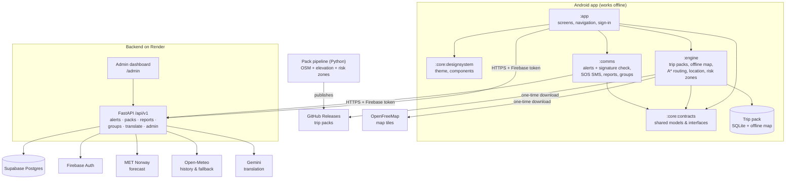

<h1 align="center">🌊 Sahay</h1>

<p align="center">
  <em>Help that still works when the network doesn't.</em><br>
  An offline-first safety app for tourists caught in floods and cyclones in India.
</p>

<p align="center">
  <a href="https://github.com/ShyamSharwan007/Sahay/releases/latest/download/sahay.apk"><strong>📲 Download APK</strong></a> &nbsp;·&nbsp;
  <a href="https://sahay-vr1c.onrender.com/admin"><strong>🖥 Admin dashboard</strong></a> &nbsp;·&nbsp;
  <a href="https://sahay-vr1c.onrender.com/api/v1/health"><strong>💚 Backend health</strong></a> &nbsp;·&nbsp;
  <a href="https://drive.google.com/file/d/1jDQ_RlSQlVfOpHVZjVOZIOIYfUme3kEv/view?usp=sharing"><strong>🎬 Demo video</strong></a>
</p>

<p align="center">
  Track: <strong>TravelTech — Real-Time Crisis Communication for Tourists During Extreme Weather Events</strong><br>
  Built in 24 hours at IIITDM Kancheepuram · Android (Kotlin, Jetpack Compose) · FastAPI · Postgres
</p>

---

## ⚡ Quick links

| What | Link |
|---|---|
| Android app (APK, Android 8.0+, ~52 MB) | https://github.com/ShyamSharwan007/Sahay/releases/latest/download/sahay.apk |
| Admin dashboard | https://sahay-vr1c.onrender.com/admin |
| Backend health check | https://sahay-vr1c.onrender.com/api/v1/health |
| Source code | https://github.com/ShyamSharwan007/Sahay |
| Demo video | [`demo/sahay-demo.mp4`](demo/sahay-demo.mp4) |

---

## ⚠️ Read this before you install

**1. Play Protect may warn or block the install.** Sahay is installed from GitHub, not the Play Store, so Android treats it as an unknown app.
- If you see **"App blocked to protect your device"** or **"Unsafe app"**: tap **More details → Install anyway**.
- If there is no "Install anyway" option: open **Play Store → profile icon → Play Protect → ⚙️ Settings → turn off "Scan apps with Play Protect"**, install Sahay, then turn it back on.
- If Chrome says **"This type of file can harm your device"**: tap **Download anyway**, then allow **"Install unknown apps"** for Chrome when Android asks.
- On Xiaomi / Redmi / POCO phones, MIUI's security scan may also ask: tap **Install anyway**.
- If you get **"App not installed"**, uninstall any older Sahay build first.

**2. Don't use a VPN.** Google sign-in fails behind most VPNs. Turn the VPN off before you sign in, or tap **Continue as guest**.

**3. The first request can take up to a minute.** The backend runs on a free server that sleeps when idle. If the first trip download or sign-in is slow, wait about 60 seconds and try again. Opening the [health link](https://sahay-vr1c.onrender.com/api/v1/health) first wakes it up.

**4. Allowing SMS for SOS.** On Android 13+ some phones block the SMS permission for apps installed outside the Play Store ("restricted setting"). To allow it: **Settings → Apps → Sahay → ⋮ (top right) → Allow restricted settings → Permissions → SMS → Allow**. Without it, SOS still works: the app opens your Messages app with the SOS text filled in, and you tap Send.

---

## 🔑 Admin access for testers

The admin dashboard is where authorities publish alerts, run the cyclone simulation, and review hazard reports. Testers can use this account:

| | |
|---|---|
| **URL** | https://sahay-vr1c.onrender.com/admin |
| **Sign in with Google** | `sahayadmin64@gmail.com` |
| **Password** | `sahay@369` |

How to use it:
1. Open the admin URL on a laptop or phone and click **Sign in with Google**. Use the account above (not a VPN).
2. Pick the region at the top (**IIITDM Kancheepuram** or **Mahabalipuram**). It must be the same region you downloaded in the app.
3. **Simulate → Simulate cyclone** publishes a signed cyclone warning and a flood-evacuation alert, and marks one shelter as full. An amber **SIMULATION MODE** badge stays on while it is active.
4. **Simulate → End simulation** expires the simulated alerts again.
5. **Reports** shows hazard reports from the app with their trust score and photo. Use **Approve** / **Reject** on photos.

> Please use this account only for testing Sahay. Everything published is clearly labelled **Simulation** in the app. If Google asks you to verify the sign-in, contact the team (see [Team](#-team)).

---

## 🚨 The problem

Every year the northeast monsoon (October–December) brings floods and cyclones to the Coromandel coast. Cyclone Nivar (2020) made landfall a few kilometres from Mahabalipuram; Cyclone Michaung (2023) flooded Chennai and Kancheepuram for days.

For a foreign tourist, three problems hit at once:
1. **Warnings arrive in a language they can't read** — English, Hindi or Tamil SMS, or none at all.
2. **The network fails** exactly when information is needed most.
3. **Nobody knows where safe ground is** — maps don't know which roads flood, and locals may not speak their language.

## 💡 The solution

**Sahay** (Hindi for "help") is an Android app plus a small backend. Set it up once while online; after that, everything critical works **with no internet at all**.

| Feature | What it does |
|---|---|
| 📦 **Offline trip pack** | One download per region: offline map, the walking road network, shelters, hospitals, police, flood-risk zones, alert templates, embassy contacts, a phrasebook, plus the trip forecast, rainfall history and past disasters in that place. |
| 🧭 **Flood-aware "Go to safety"** | Routes you on real walking paths to the nearest open shelter, avoiding flood-prone roads and low ground. Runs fully on the phone. Shows "Avoids flood-prone roads", distance and walking time, and other safe places nearby. |
| ✅ **Signed official alerts** | Every alert is a short signed message (Ed25519). The phone checks the signature offline, so a forwarded fake can't pretend to be official. Shown as **"Verified official"**. |
| 🌐 **Your language, 9 of them** | The app and alerts are available in English, German, French, Spanish, Russian, Japanese, Korean, Chinese and Arabic (with right-to-left layout). |
| 📋 **Paste an alert** | Got a local SMS you can't read? Paste it; Sahay recognises official warnings by keyword and translates them. |
| 🗣 **Show to a local** | A big, high-contrast card in **Tamil** with where you need to go and your medical details. A phrasebook that speaks Tamil aloud, and "Say something else" for free-text translation to Tamil (online). |
| 🆘 **SOS by plain SMS** | A 5-second cancellable countdown, then an SMS to all your emergency contacts with a map link, blood group, allergies and where you're staying. Needs only a SIM signal. "Call 112" is always one tap away. |
| 📸 **Hazard reports with photos** | Report a flooded road, blocked path or shelter problem — even offline. It's queued and sent when you reconnect. Add a photo (compressed, location metadata stripped). Every report gets a **trust score** (Verified / Likely / Unconfirmed); photos are auto-approved at high trust or reviewed by an admin. |
| 👥 **Find people** | In Emergency Mode, see nearby groups of people already at a shelter or safe area — only groups, never individuals. |
| 🌙 **Emergency Mode** | A black, battery-saving screen with the four actions that matter, battery estimate, and connection status. Exit needs a 2-second hold. Also warns you when you walk into a high-risk zone. |
| 🌦 **Trip weather** | Forecast for your trip days (MET Norway), plus "what usually happens here" from 5 years of rainfall history. |
| 🔔 **Update notice** | The app tells you when a newer version is on GitHub. |

### What's new compared to existing apps

| Existing apps | Sahay |
|---|---|
| Need internet for maps, alerts and routing | Works fully offline after one download |
| Anyone can forward a fake "evacuate now" message | Alerts are digitally signed and verified on the phone |
| Warnings only in local languages | 9 languages, plus a Tamil card to show locals |
| Navigation ignores flood risk | Every road segment has a flood-risk cost; routes go around danger |
| Rumours spread unchecked | Reports carry a trust score and photo review |
| Location sharing exposes individuals | Group finder shows clusters only, never a single person |
| Heavy, battery-hungry UIs | Minimal, flat, OLED-friendly design; no background services |

---

## 🧪 How to test (about 10 minutes)

**You need:** an Android phone (8.0+) with a SIM if you want to try SOS, and optionally a laptop for the admin dashboard. Read [⚠️ Read this before you install](#️-read-this-before-you-install) first.

**Setup (online)**
1. Download and install the [APK](https://github.com/ShyamSharwan007/Sahay/releases/latest/download/sahay.apk).
2. Pick your language → **Sign in with Google** (VPN off) or **Continue as guest**.
3. Fill in your profile. Fields marked `*` are required. Add a real emergency contact (a friend's number) to test SOS.
4. Trip setup → choose **IIITDM Kancheepuram** (if you're on campus) or **Mahabalipuram** → pick dates in the next few days → **Download**. The Ready screen shows the forecast, rainfall history and past cyclones.

**Official alert (online)**
5. On the admin dashboard (see [Admin access](#-admin-access-for-testers)), choose the same region → **Simulate cyclone**.
6. Within about 2 minutes the phone shows the alert in your language with **"Verified official"** and a **Simulation** label. Open it → **Go to safety**.
7. Try **Alerts → Paste an alert** with any made-up "evacuate" text: it is *not* shown as verified.

**Offline**
8. Turn on **airplane mode** ✈️.
9. **Go to safety** — the route follows real paths and bends around the red risk zones. Try **Other safe places nearby** and the full-screen map.
10. **Show to a local** — the Tamil card and phrasebook (tap a phrase to expand it, 🔊 to hear it).
11. **Report a hazard** → Flooded road → add a photo → Submit. It says "Saved. Will send when connected".
12. **Emergency Mode** → explore the black low-power screen. For **SOS**, turn airplane mode off but keep **Wi-Fi and mobile data off** (SIM signal only — like during a storm), then tap SOS and let the countdown finish. Your contact receives the SMS with your location and medical details.

**Back online**
13. Turn airplane mode off. The report sends; it appears in **Admin → Reports** with its trust score and photo → **Approve**.
14. **Admin → End simulation** to clear the cyclone.

---

## 🏗 Architecture



**How the pieces fit**
- The phone downloads a **trip pack** once: a SQLite file (roads, shelters, risk zones, templates, phrases) from GitHub Releases, plus offline map tiles from OpenFreeMap. From then on, maps, routing, the Tamil card and alert verification run locally.
- The **backend** signs alerts, serves pack manifests (with the trip forecast and history), stores and scores reports, clusters people into groups, and translates text.
- The **admin dashboard** is a single page served by the backend.

### How it works under the hood

| Part | Approach |
|---|---|
| **Routing** | A* search over the pack's walking graph. Edge cost = `length × (1 + risk_cost)`. Picks the cheapest of the 5 nearest open shelters (not FULL/CLOSED, not inside a high-risk zone), falls back to the nearest hospital, then to a direction-only line. Roads near verified flood reports are avoided. |
| **Flood-risk cost** (per road segment, in the pipeline) | `clamp(3·inHighZone + 1.5·inMediumZone + elevation + 1.0·within150mOfRiverOrCoast, 0, 5)`; elevation adds 1.5 below 3 m and 0.8 at 3–6 m. High zones are curated from documented 2015/2020/2023 flooding; medium zones are 150 m buffers around water. |
| **Signed messages** | Compact text format `SH1*<type>*…*<timestamp>*<signature>` (≤ 160 chars, so it fits one SMS). Ed25519 signature, verified on the phone with the public key shipped in the pack. |
| **Trust score** | `(0.25·proximity + 0.30·corroboration + 0.20·official match + 0.10·evidence + 0.15·reporter history) × recency` → Verified / Likely / Unconfirmed. |
| **Group finder** | DBSCAN (100 m radius) on opted-in positions; only group centres rounded to ~110 m are returned, and only groups above a minimum size. |
| **Alerts lifecycle** | Alerts carry region, issue time and expiry (simulations expire after 6 h). Phones only show alerts for the region and dates of their trip. |
| **Low power** | No foreground services, no WorkManager, no background location. Polling only while the app is open. Flat, OLED-friendly dark theme with no gradients or looping animations; Emergency Mode is pure black. |

---

## 🗂 Repository layout

```
android/
  app/                 screens, navigation, sign-in, profile (Jetpack Compose)
  core/contracts/      shared models and interfaces between modules
  core/designsystem/   theme, colours, typography, components
  engine/              trip packs, offline map, routing, location, risk monitor
  comms/               alerts + signature check, SOS SMS, reports, groups
backend/
  app/                 FastAPI app (routers, services, signing, admin page in static/admin.html)
  pipeline/            trip-pack builder (OSM, elevation, risk zones) and publisher
  data/curated/        hand-drawn risk zones and shelters per region
  tests/               backend tests
docs/                  CONTRACTS.md (API, wire format, pack schema), DESIGN.md (UI rules)
samples/               sample trip pack
demo/                  demo video
```

---

## 🛠 Developer setup

### Android
Requirements: Android Studio (latest stable), JDK 17, an Android 8.0+ device.

```bash
git clone https://github.com/ShyamSharwan007/Sahay.git
cd Sahay/android
./gradlew :app:installDebug          # debug build on a connected phone
./gradlew :app:assembleRelease       # release APK → app/build/outputs/apk/release/
./gradlew testDebugUnitTest          # unit tests
```
`google-services.json` and the shared signing keystore (`android/keystore/sahay.keystore`, alias `sahay`, password `sahay123`) are committed on purpose so every build signs the same way and Google sign-in keeps working. They protect nothing sensitive.

### Backend
Requirements: Python 3.12+, [uv](https://docs.astral.sh/uv/).

```bash
cd backend
uv sync
uv run python scripts/gen_keys.py                 # creates an Ed25519 key pair (once)
uv run uvicorn app.main:app --reload              # http://localhost:8000/admin
uv run pytest -q
```
Environment variables (put them in `backend/.env`, never commit it): `DATABASE_URL`, `FIREBASE_SERVICE_ACCOUNT_B64`, `FIREBASE_WEB_*`, `SIGNING_PRIVATE_KEY_B64`, `SIGNING_PUBLIC_KEY_B64`, `ADMIN_EMAILS`, `LLM_API_KEY`, `LLM_MODEL`, `GROUP_MIN_SIZE`, `CORS_ORIGINS`. See [`backend/README.md`](backend/README.md) and [`docs/CONTRACTS.md`](docs/CONTRACTS.md).

Deployment: Render web service with root directory `backend` (see `backend/render.yaml`), health check `/api/v1/health`.

### Trip-pack pipeline
```bash
cd backend
# PowerShell: $env:SIGNING_PUBLIC_KEY_B64="<public key>"
export SIGNING_PUBLIC_KEY_B64=<public key>
uv run --with-requirements pipeline/requirements.txt python -m pipeline.build_pack --region iiitdm-kancheepuram
uv run --with-requirements pipeline/requirements.txt python -m pipeline.build_pack --region mahabalipuram
uv run --with-requirements pipeline/requirements.txt python -m pipeline.publish     # uploads to the packs-v1 release
uv run --with-requirements pipeline/requirements.txt --with pytest python -m pytest pipeline/tests -q
```
Regions: `iiitdm-kancheepuram` (bbox 80.13, 12.82, 80.18, 12.86) and `mahabalipuram` (bbox 80.16, 12.59, 80.21, 12.65).

### Tests
About **500 Android unit tests** (routing, wire format, signature verification, alert filtering, SOS message building, report queue, trust maths, groups) and about **150 backend and pipeline tests** (API routes, signing, trust score, forecasts with mocked providers, pack building).

---

## 📚 Open-source libraries, APIs and data

### Android
| Library | Use | License |
|---|---|---|
| Kotlin, kotlinx.coroutines, kotlinx.serialization | Language, async, JSON | Apache-2.0 |
| Jetpack Compose, Material 3, Material Icons | UI | Apache-2.0 |
| AndroidX (Activity, Lifecycle, Navigation, DataStore, Room, Core SplashScreen, ExifInterface, AppCompat, Credentials) | App architecture, storage, navigation | Apache-2.0 |
| Hilt / Dagger | Dependency injection | Apache-2.0 |
| OkHttp, Retrofit | Networking | Apache-2.0 |
| MapLibre Native Android | Offline vector maps | BSD-2-Clause |
| Google Tink | Ed25519 signature verification | Apache-2.0 |
| Firebase Authentication, Google Identity (googleid) | Google and guest sign-in | Apache-2.0 (SDK) / Google ToS |
| Google Play services Location | Fused location | Android SDK License |
| libphonenumber-android | Phone number validation, country codes | Apache-2.0 |
| Manrope font | Typography | SIL OFL 1.1 |
| JUnit 4, MockK, Turbine, Robolectric, MockWebServer | Tests | EPL-1.0 / Apache-2.0 / MIT |

### Backend and pipeline
| Library | Use | License |
|---|---|---|
| FastAPI, Pydantic, pydantic-settings, Uvicorn | API server | MIT / BSD-3-Clause |
| SQLAlchemy, psycopg | Database | MIT / LGPL-3.0 |
| firebase-admin | Verifying sign-in tokens | Apache-2.0 |
| cryptography | Ed25519 signing | Apache-2.0 / BSD |
| httpx | Calls to weather and translation APIs | BSD-3-Clause |
| slowapi | Rate limiting | MIT |
| scikit-learn, NumPy | DBSCAN group clustering | BSD-3-Clause |
| python-multipart | Photo uploads | Apache-2.0 |
| osmnx, GeoPandas, Shapely, pyproj, requests | Building trip packs from OpenStreetMap | MIT / BSD-3-Clause / Apache-2.0 |
| pytest, respx, ruff | Tests and linting | MIT / BSD-3-Clause |
| MapLibre GL JS, Firebase JS SDK | Admin dashboard map and sign-in | BSD-3-Clause / Apache-2.0 |

### APIs and data sources
| Source | Use | License / terms |
|---|---|---|
| [OpenStreetMap](https://www.openstreetmap.org/copyright) contributors | Roads, paths, shelters, hospitals, police | ODbL |
| [OpenFreeMap](https://openfreemap.org/) | Offline map tiles and styles | Free, attribution required |
| [MET Norway Locationforecast](https://api.met.no/) | Trip forecast (primary) | CC BY 4.0 / NLOD |
| [Open-Meteo](https://open-meteo.com/) | Forecast fallback, 5-year rainfall history, elevation for risk costs | CC BY 4.0 |
| [Google Gemini API](https://ai.google.dev/) | Translation of alerts, content and "Say something else" | Google API terms |
| [Firebase Authentication](https://firebase.google.com/products/auth) | Sign-in | Google terms |
| [Supabase](https://supabase.com/) | Hosted Postgres | Supabase terms |
| [Render](https://render.com/) | Backend hosting | Render terms |
| GitHub Releases | Hosting the APK and trip packs | GitHub terms |

Weather data from MET Norway and Open-Meteo (CC BY 4.0). Map data © OpenStreetMap contributors.

### AI coding tools used
- **Claude Code** (Anthropic) — code generation, debugging, refactoring and reviews.
- **Antigravity** (Google) — backend, content pipeline and translations.

---

## ⚠️ Honest limitations and future work

| Limitation | Why | Next step |
|---|---|---|
| The app can't read incoming government SMS | Play Protect blocks apps installed outside the Play Store that read SMS, so we removed that permission. Use **Paste an alert** instead. | Restore automatic detection when distributed through the Play Store. |
| Cell-broadcast emergency alerts can't be read | Android doesn't let apps read them. | Use them if Android opens an API. |
| Live flood levels are unknown offline | Offline routing uses risk zones and reports saved in the pack. | Cache live water-level gauges (CWC / state agencies) when online. |
| Ending a simulation doesn't instantly clear phones that already received it | Phones drop it when it expires (6 hours) or on their next refresh. | Push a signed "cancel" message. |
| Free backend sleeps when idle | Free hosting tier. | Paid tier or keep-alive monitor. |
| Some elevation points are estimated from neighbours | The elevation API's daily limit was reached while building packs. | Rebuild packs with full elevation data. |
| No phone-to-phone relay yet | Bluetooth mesh and SMS relay were designed (the message format already fits one SMS) but not built in 24 h. | Bluetooth LE relay of signed alerts between phones. |
| Two regions only | Time. | More coastal tourist regions (Chennai, Puducherry, Goa, Kerala). |
| GPS only | | NavIC support where devices allow; LoRa gateways at shelters. |

---

## 👥 Team

| | Name | Role | Built |
|---|---|---|---|
| **A** | **Sharwan** | Android app lead & team lead | All app screens, navigation, sign-in and profile, design system, translations, Emergency Mode, SOS screen, release builds, final admin and photo-report upgrade |
| **B** | **Akshay** | Engine & communications | Trip-pack download, offline map, flood-aware routing, location and risk monitor, alerts and signature checks, SOS SMS, reports queue, group finder, pack pipeline |
| **C** | **Kanishka** | Backend | FastAPI backend, signing, alerts and simulation, manifest with forecast and history, reports and trust score, groups, translation, admin dashboard, deployment |
| **D** | **Janith** | Content, data, testing & docs | Accounts and setup, translated content, risk zones and shelters, device testing, README and demo video |

Questions while testing? Open an issue on the repo or contact the team.

---

<p align="center">
  Built in 24 hours at IIITDM Kancheepuram 🏫 · Stay safe, wherever you travel.
</p>
