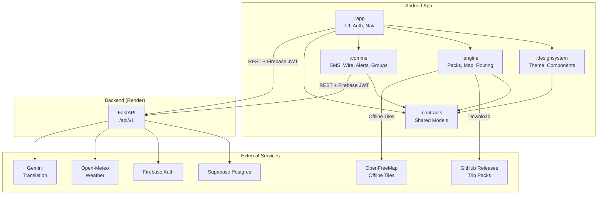

<p align="center">
  <strong>🌊 Sahay</strong><br>
  <em>Your offline-first safety companion for floods and cyclones in India</em>
</p>

<p align="center">
  <a href="https://github.com/ShyamSharwan007/sahay/releases/latest/download/sahay.apk"><strong>📲 Download APK</strong></a> &nbsp;|&nbsp;
  <a href="https://sahay-backend-k2wu.onrender.com/admin"><strong>🖥 Admin Dashboard</strong></a> &nbsp;|&nbsp;
  <a href="https://sahay-backend-k2wu.onrender.com/api/v1/health"><strong>💚 Backend Health</strong></a> &nbsp;|&nbsp;
  <a href="demo/sahay-demo.mp4"><strong>🎬 Demo Video</strong></a>
</p>

---

## 🚨 Problem Statement

**TravelTech: Real-Time Crisis Communication for Tourists During Extreme Weather Events**

Every year, India's northeast monsoon season (October–December) brings devastating floods and cyclones to the Coromandel Coast. Foreign tourists visiting heritage sites like Mahabalipuram are left without reliable safety information — government alert SMS messages arrive only in English, Hindi or Tamil, existing weather apps don't know which roads are flooded, and there is no offline-capable tool that can route you to the nearest safe shelter when cell towers go down.

When Cyclone Nivar hit within metres of Mahabalipuram in 2020, tourists had no way to find shelters, read official warnings in their language, or signal their location to rescuers — all while the internet was gone for days.

---

## 💡 Solution

**Sahay** (Hindi for "help") is an Android app that gives foreign tourists everything they need to stay safe during extreme weather — and it works without internet.

### Key Features

| Feature | How it works |
|---|---|
| **Offline-first trip packs** | Download a pre-built SQLite pack with shelters, hospitals, police stations, a walking-path graph, risk zones, alert templates, embassy contacts and a phrasebook — all for your specific region. The app works fully offline after download. |
| **Flood-aware routing** | Dijkstra routing on a pedestrian graph where every edge has a risk cost based on flood zones, elevation and coastal proximity. The app finds the safest path to the nearest open shelter, avoiding flooded roads. |
| **Cryptographically signed alerts** | Each official alert is an Ed25519-signed wire string (`SH1*A*...`) that can be verified offline. Alerts cannot be spoofed, even when forwarded via SMS or Bluetooth mesh. |
| **9-language translation** | All alerts, precautions, and "show to a local" phrasebook cards are available in English, German, French, Spanish, Russian, Japanese, Korean, Chinese and Arabic. Tamil text is included for showing to locals. |
| **Government SMS translation** | Incoming official SMS (in English/Hindi/Tamil) is matched to alert templates using keyword detection and Gemini, then translated to the tourist's language. |
| **Trust-scored crowd reports** | Users can report floods, road blocks or shelter status. Each report gets a trust score (proximity × corroboration × official match × evidence × history × recency) and is labelled VERIFIED, LIKELY or UNCONFIRMED. |
| **Privacy-preserving group finder** | Presence data is clustered with DBSCAN (100 m, min 5 people). The server never exposes individual locations — only group centres rounded to ~110 m. Beacons let tourists signal "I'm here, come find me." |
| **SOS with medical info** | One-tap SOS sends your GPS coordinates, blood type, allergies and emergency contacts via SMS — works without internet. |
| **Emergency mode** | When activated, the app sends periodic presence heartbeats, polls for group updates, and keeps the map centred on your location. |

### What's new compared to existing apps

| Existing apps | Sahay |
|---|---|
| Require internet for everything | Works fully offline after a one-time pack download |
| Alerts can be faked by anyone | Ed25519 signatures — impossible to spoof |
| Government SMS only in local languages | Auto-translated to your language using keyword matching + LLM |
| Generic routing ignores flood risk | Every edge has a risk cost; routes avoid flooded and low-elevation roads |
| No group awareness | Privacy-preserving DBSCAN clustering shows nearby groups without exposing individuals |
| No trust scoring on crowd reports | 5-factor trust formula labels reports as VERIFIED, LIKELY or UNCONFIRMED |

---

## 🏗 Architecture



---

## 🧪 How Judges Can Test

### Quick start (5 minutes)

1. **Install** — download `sahay.apk` from [Releases](https://github.com/ShyamSharwan007/sahay/releases/latest/download/sahay.apk) and sideload it.
2. **Sign in** — use Google sign-in, or tap "Continue as Guest" for anonymous Firebase auth.
3. **Pick a region** — choose **"IIITDM Kancheepuram"** (if you're on campus) or **"Mahabalipuram"**.
4. **Download the trip pack** — this takes ~30 seconds. You now have offline maps, shelters, routing graph and phrasebook.

### Test offline features

5. **Turn on airplane mode** ✈️
6. **"Go to safety"** — tap the safety button. The app routes you to the nearest open shelter, avoiding flood-risk roads.
7. **"SOS"** — tap the SOS button. It composes an SMS with your GPS, medical info and emergency contacts.
8. **"Show to a local"** — open the phrasebook. Tap a phrase to see it in Tamil, ready to show to someone nearby.
9. **Alerts** — view cached alerts. Each alert has a verified signature badge.

### Test online features

10. **Turn off airplane mode**
11. **We publish a simulation alert** from the admin dashboard (`POST /admin/simulate` with `scenario: cyclone`). The app polls and shows the new alert within 2 minutes.
12. **Submit a hazard report** — long-press the map, pick "Flood", submit. Check `/reports` to see your report with its trust score.

---

## 🛠 Developer Setup

### Android

```bash
# Clone the repo
git clone https://github.com/ShyamSharwan007/sahay.git
cd sahay

# Open android/ in Android Studio (Hedgehog or later)
# Sync Gradle, then run on a device or emulator (API 26+)
./gradlew :app:assembleDebug
```

> **Note:** `google-services.json` and the shared keystore are committed intentionally. Passwords: alias `sahay`, store/key password `sahay123`.

### Backend

See [`backend/README.md`](backend/README.md) for full details.

```bash
cd backend
uv sync
uv run uvicorn app.main:app --reload    # http://localhost:8000
uv run pytest                           # run tests
```

### Content pipeline

```bash
cd backend
export LLM_API_KEY=<your-gemini-key>
export LLM_MODEL=gemini-2.5-flash
uv run python pipeline/build_pack.py    # build trip packs
```

---

## 📚 Open-Source Libraries, APIs & Licenses

### Libraries

| Library | Purpose | License |
|---|---|---|
| [MapLibre Native](https://github.com/maplibre/maplibre-native) | Offline vector maps | BSD-2-Clause |
| [Jetpack Compose](https://developer.android.com/jetpack/compose) | Android UI toolkit | Apache-2.0 |
| [Hilt / Dagger](https://dagger.dev/hilt/) | Dependency injection | Apache-2.0 |
| [OkHttp](https://square.github.io/okhttp/) | HTTP client | Apache-2.0 |
| [FastAPI](https://fastapi.tiangolo.com/) | Python web framework | MIT |
| [SQLAlchemy](https://www.sqlalchemy.org/) | Database ORM | MIT |
| [psycopg](https://www.psycopg.org/) | PostgreSQL driver | LGPL-3.0 |
| [scikit-learn](https://scikit-learn.org/) | DBSCAN clustering | BSD-3-Clause |
| [PyNaCl](https://github.com/pyca/pynacl) | Ed25519 signatures | Apache-2.0 |

### APIs & Data Sources

| Source | Usage | License / Terms |
|---|---|---|
| [OpenStreetMap](https://www.openstreetmap.org/) | Road network, POIs, building data | ODbL |
| [OpenFreeMap](https://openfreemap.org/) | Offline vector tile basemap | Free (attribution required) |
| [Open-Meteo](https://open-meteo.com/) | Weather forecast and historical data | CC BY 4.0 |
| [MET Norway](https://api.met.no/) | Weather forecast (primary source) | CC BY 4.0 |
| [Firebase Auth](https://firebase.google.com/products/auth) | User authentication (anonymous + Google) | Google ToS |
| [Supabase](https://supabase.com/) | Hosted PostgreSQL | Apache-2.0 (self-hosted) |
| [Google Gemini API](https://ai.google.dev/) | SMS translation and template matching | Google AI ToS |
| [Open-Elevation](https://open-elevation.com/) | Elevation data for risk cost calculation | Public domain |

### AI Coding Tools Used

- **Claude Code** (Anthropic) — used for code generation, debugging and architecture review.
- **Antigravity** (Google DeepMind) — used for code generation, debugging and content pipeline development.

---

## ⚠️ Honest Limitations

| Limitation | Why | Future scope |
|---|---|---|
| **Cell broadcast alerts can't be read** | Android restricts apps from reading CB messages (WAP-push / CMAS). We rely on SMS forwarding and server-side alert publishing instead. | If Google opens a CB listener API, we'd integrate it. |
| **Live flood status is unknown offline** | Once airplane mode is on, the app uses the risk zones baked into the trip pack, not live water levels. | Integrate NDRF / CWC live flood gauges and cache recent readings. |
| **SMS relay requires SIM and permissions** | The SOS SMS feature needs SMS permission and a working SIM card. Bluetooth mesh is designed but not yet implemented. | Full SMS relay (device-to-device) and Bluetooth Low Energy mesh for passing alerts without internet. |
| **Limited regions** | Currently only Mahabalipuram and IIITDM Kancheepuram are supported. | Add more coastal tourist regions: Chennai Central, Puducherry, Goa, Kerala. |
| **No NavIC integration** | GPS only. NavIC (India's satellite system) could provide better accuracy in South Asia. | Integrate NavIC via Android's GNSS API when more devices support it. |
| **No LoRa hardware** | Long-range, low-power alerts via LoRa would extend range beyond Bluetooth. | Partner with disaster response agencies to deploy LoRa gateways at shelters. |

---

## 👥 Team

| Person | Role | Modules |
|---|---|---|
| **A** | Android lead | `:app`, `:designsystem`, navigation, auth, profile, UI |
| **B** | Engine lead | `:engine` — packs, offline map, routing, location, geofencing |
| **C** | Backend lead | `backend/` — FastAPI, data pipeline, trip packs, Supabase |
| **D** | Comms lead | `:comms` — SMS, wire codec, alerts, reports, groups, mesh; `admin/`; `README.md` |

---

<p align="center">
  Built in 24 hours at IIITDM Kancheepuram 🏫
</p>